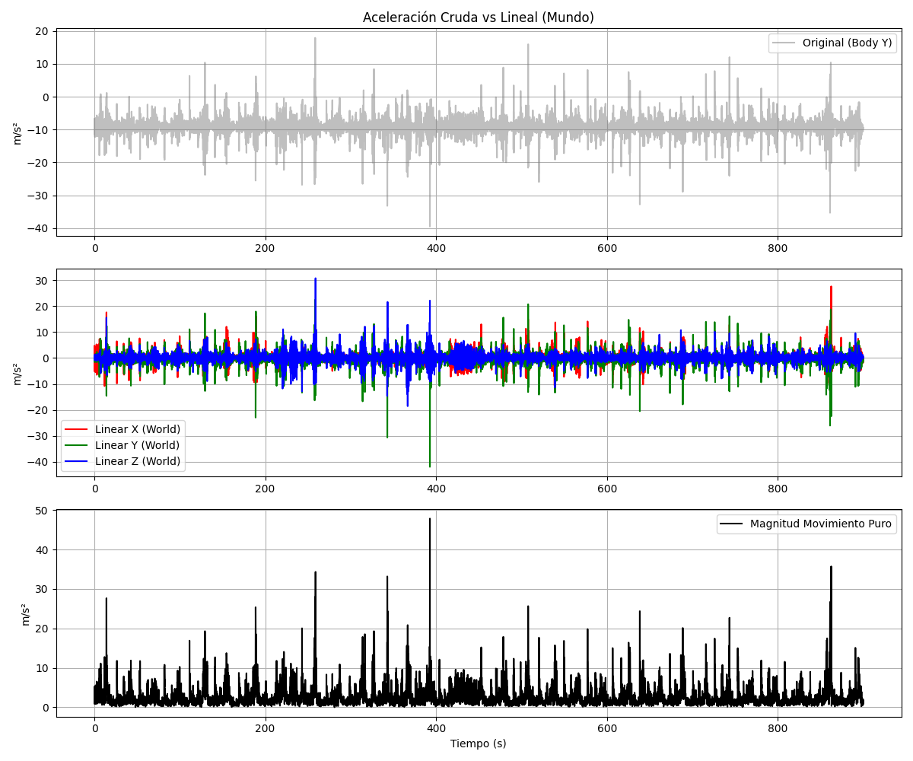
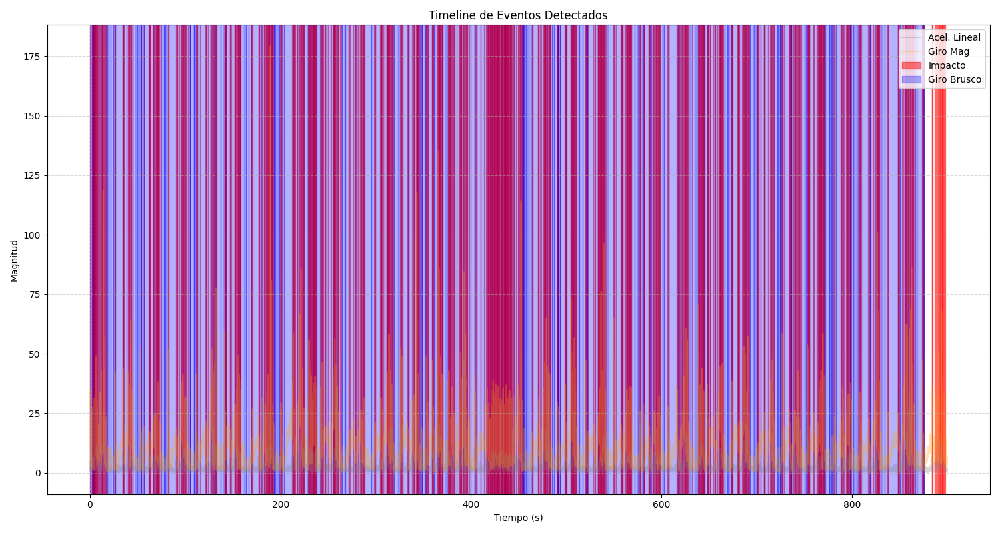

# Proyecto JEBI - Hackaton 2026 🚀

**Análisis Multimodal de Datos Inerciales y Video para la Detección de Eventos Críticos.**

Este proyecto presenta un pipeline completo de ingeniería de datos para el procesamiento, sincronización y análisis de sensores IMU y video de alta fidelidad.

---

## 🎯 Objetivo
Transformar datos inerciales crudos y video no estructurado en **información accionable**, identificando patrones de movimiento puro y eventos de impacto con precisión milimétrica.

## 🛠️ Hitos de Ingeniería (Highlights)

### 1. Sincronización Multimodal Perfecta (1:1)
Logramos establecer una correspondencia exacta entre los **9403 frames** de video y las **9403 muestras** del IMU. Cada frame de la cámara está respaldado por un vector inercial completo.
- [Detalles en Sincronización (EDA.md)](./docs/EDA.md)

### 2. Purificación de Señal (Eliminación de Gravedad)
Implementamos algoritmos de rotación espacial usando cuaterniones para extraer la **Aceleración Lineal** en el marco del mundo. Esto nos permite medir el movimiento real del dispositivo, independientemente de su inclinación.
- [Detalles en Pre-procesamiento](./docs/PREPROCESSING.md)

### 3. Detección Inteligente de Eventos
Automatizamos la identificación de **930 impactos** y **135 giros bruscos** utilizando umbrales adaptativos y análisis de magnitud total.
- [Listado de Eventos Detectados](./docs/EVENTS.md)

### 4. Firma de Frecuencia (FFT)
Aplicamos Transformadas de Fourier para caracterizar el comportamiento rítmico del sistema, descartando patrones de marcha humana y confirmando dinámicas vehiculares/operativas.
- [Análisis de Frecuencia](./docs/FREQUENCY.md)

---

## 📈 Visualizaciones Clave

| Aceleración Lineal (Mundo) | Timeline de Eventos |
| :---: | :---: |
|  |  |

---

## 📂 Estructura del Repositorio
- `data/`: Directorio de datos crudos (IMU .npy y Video .mp4).
- `scripts/`: Suite de herramientas en Python para reproducción del análisis.
- `docs/`: Documentación técnica detallada y reportes de cada fase.

## 🚀 Cómo Reproducir
Este proyecto utiliza `uv` para una gestión de dependencias ultra-rápida y reproducible.

```bash
# Ejecutar el análisis completo
uv run scripts/eda.py
uv run scripts/linear_accel_extraction.py
uv run scripts/event_detection.py
uv run scripts/frequency_analysis.py
```

---
*Desarrollado para la Hackaton Jebi 2026. ¡Vamos por la victoria! 🏆*
