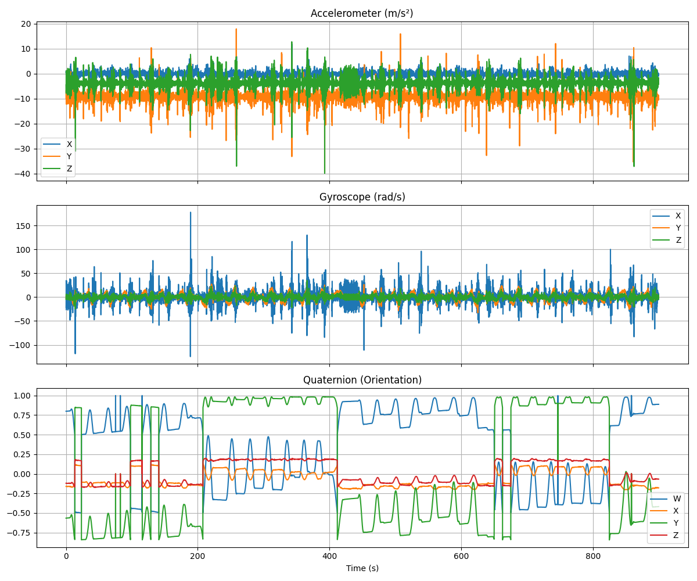
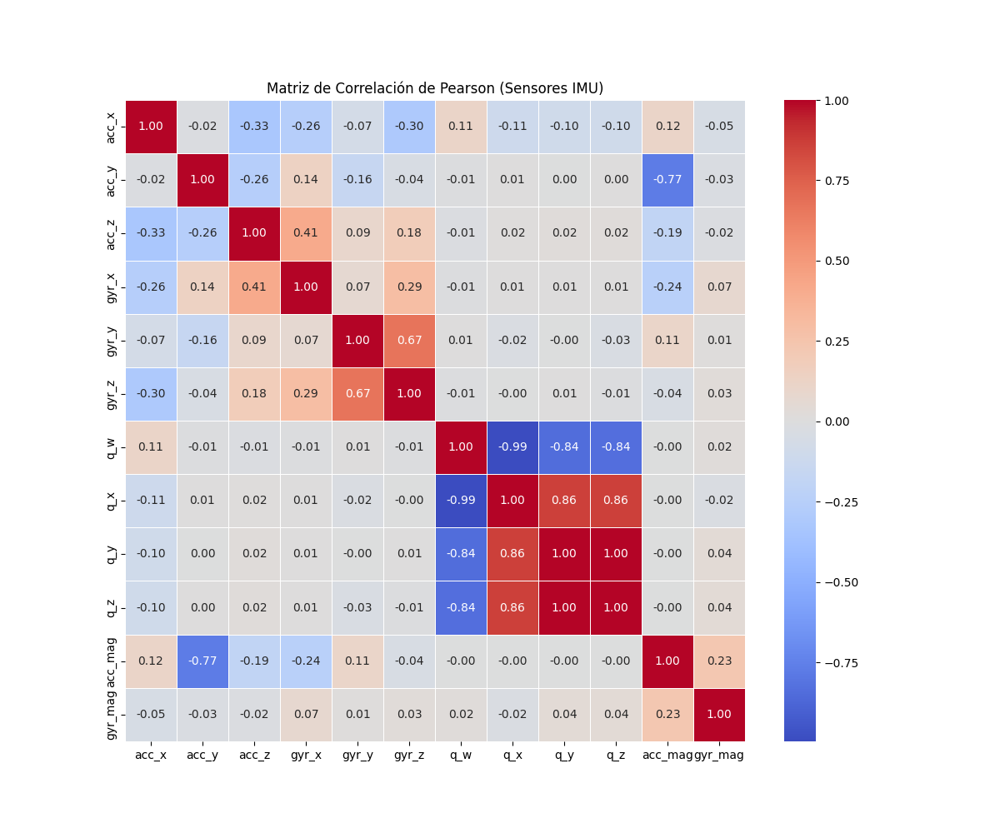
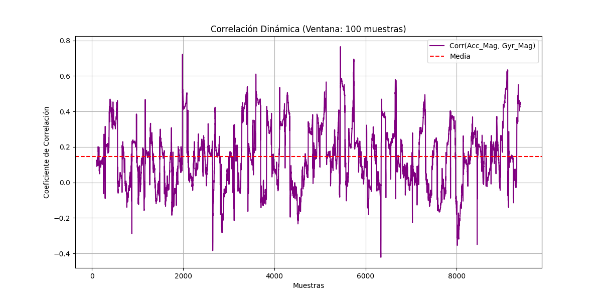
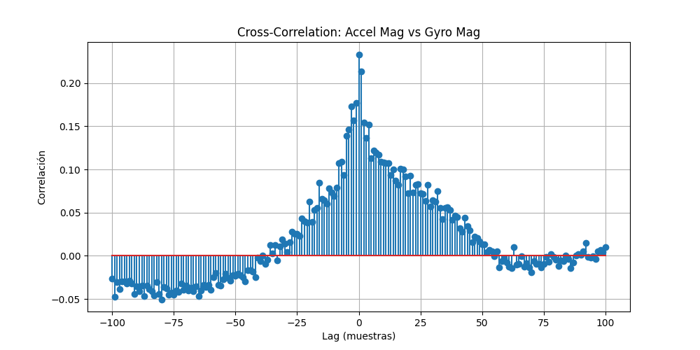
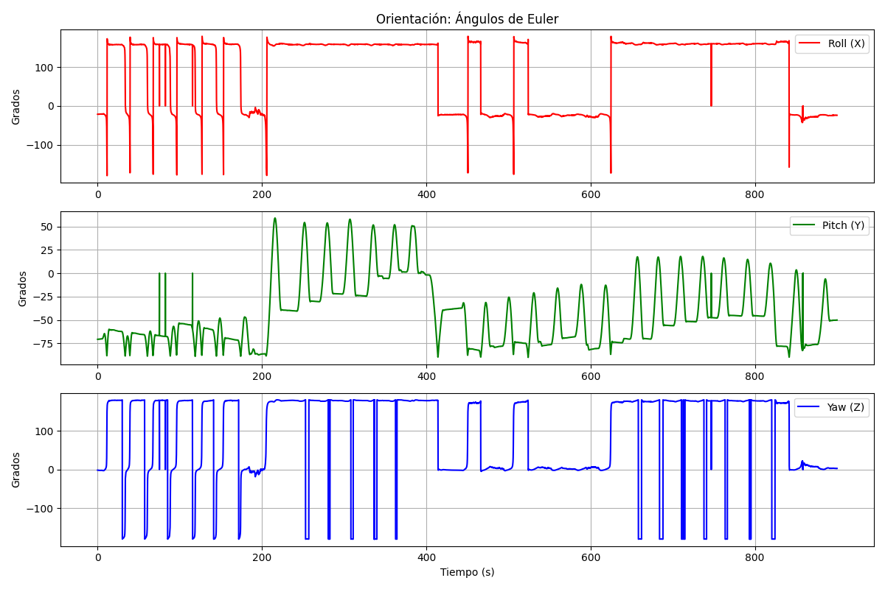

# Análisis Exploratorio de Datos (EDA) - IMU

Este documento detalla la estructura y el contenido de los datos inerciales (IMU) encontrados en el archivo `.npy`.

## Estructura del Archivo
El archivo `data/40343737_20260313_110600_to_112100_imu.npy` contiene una matriz de **9403 filas** y **11 columnas**.

### Definición de Columnas
A partir del análisis de los datos, se ha determinado la siguiente estructura:

| Índice | Nombre | Unidad | Descripción |
| :--- | :--- | :--- | :--- |
| 0 | `timestamp` | ns | Tiempo en nanosegundos (Unix Epoch). |
| 1 | `accel_x` | m/s² | Aceleración en el eje X. |
| 2 | `accel_y` | m/s² | Aceleración en el eje Y. |
| 3 | `accel_z` | m/s² | Aceleración en el eje Z. |
| 4 | `gyro_x` | rad/s | Velocidad angular en el eje X. |
| 5 | `gyro_y` | rad/s | Velocidad angular en el eje Y. |
| 6 | `gyro_z` | rad/s | Velocidad angular en el eje Z. |
| 7 | `quat_w` | - | Componente W (escalar) del cuaternión de orientación. |
| 8 | `quat_x` | - | Componente X del cuaternión de orientación. |
| 9 | `quat_y` | - | Componente Y del cuaternión de orientación. |
| 10 | `quat_z` | - | Componente Z del cuaternión de orientación. |

## Visualización
A continuación se muestra la serie temporal de los sensores:

### Observaciones Clave:
- **Gravedad:** El eje `accel_y` muestra un valor base cercano a -9.8 m/s², lo que indica que el eje Y está alineado verticalmente con la gravedad en la posición de reposo.
- **Ruidos y Eventos:** Se observan picos de aceleración que sugieren movimientos bruscos o vibraciones durante la captura.
- **Orientación:** Los cuaterniones son estables, permitiendo una reconstrucción precisa de la actitud del dispositivo.

## Análisis de Correlación

Para entender la interdependencia entre los sensores, se aplicaron tres técnicas de análisis estadístico:

### 1. Matriz de Correlación de Pearson
Mide la relación lineal global entre todos los pares de variables.

**Hallazgos:**
- **Orientación:** Existe una correlación altísima entre `q_y` y `q_z` (0.99), lo que sugiere un movimiento de rotación acoplado en esos ejes durante la captura.
- **Sensores:** Se observa una correlación moderada entre `gyr_z` y `gyr_y` (0.67), indicando giros simultáneos.

### 2. Correlación Dinámica (Rolling Correlation)
Analiza cómo cambia la relación entre la magnitud de la aceleración y la magnitud del giro a lo largo del tiempo.

Esto permite identificar fases de movimiento coordinado vs. fases de impacto o vibración pura.

### 3. Correlación Cruzada (Cross-Correlation)
Identifica si existe un retraso (lag) entre la respuesta del acelerómetro y el giroscopio.

**Interpretación:** Un pico en el lag 0 indica una respuesta instantánea y sincronizada entre ambos sensores.

## Análisis de Actitud (Orientación)

Para una interpretación humana de la orientación, los cuaterniones se convirtieron a **Ángulos de Euler (Roll, Pitch, Yaw)**.

**Análisis de los resultados:**
- **Roll (Balanceo):** Se observa un rango de movimiento amplio, indicando cambios laterales significativos.
- **Pitch (Cabeceo):** El promedio de -43 grados sugiere que el dispositivo mantuvo una inclinación constante hacia adelante/atrás durante gran parte de la captura.
- **Yaw (Guiñada):** Refleja los cambios de dirección o rotaciones sobre el eje vertical.

Este análisis es fundamental para reconstruir la trayectoria o la intención del movimiento en el espacio 3D.

## Sincronización de Video
Existen archivos de video (`left.mp4` y `right.mp4`) que corresponden al mismo periodo de tiempo. El siguiente paso será alinear los timestamps del IMU con los frames de los videos para un análisis multi-modal.
