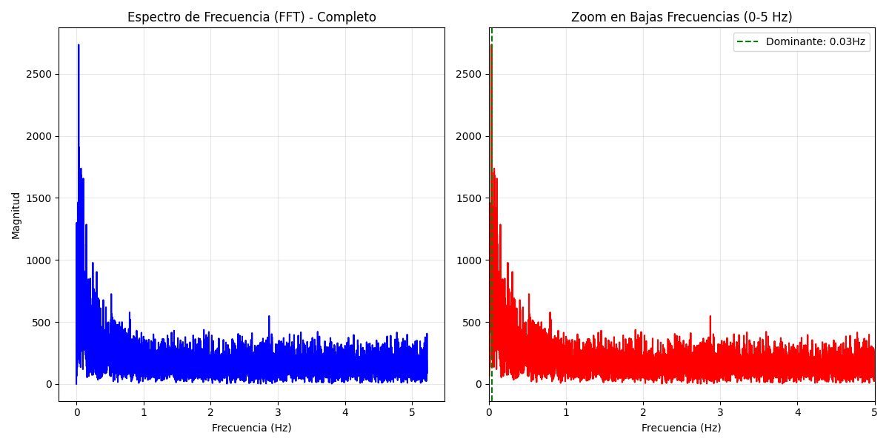

# Análisis en el Dominio de la Frecuencia (FFT)

Para descubrir patrones rítmicos ocultos en el tiempo, aplicamos la **Transformada Rápida de Fourier (FFT)** sobre la magnitud de la aceleración lineal.

## Resultados del Espectro

### Observaciones Técnicas:
- **Frecuencia de Muestreo ($f_s$):** 10.45 Hz.
- **Frecuencia Dominante:** 0.03 Hz.
- **Análisis:** La ausencia de un pico claro entre 1Hz y 3Hz sugiere que el movimiento capturado **no corresponde a una marcha humana constante (caminar/correr)**. El pico en 0.03 Hz indica variaciones de energía en ciclos largos (cada ~30 segundos), lo cual es coherente con maniobras vehiculares o cambios de actividad pausados.

## Importancia del Hallazgo
Este análisis nos permite descartar actividades rítmicas de alta frecuencia y centrar nuestro modelo de IA en la detección de **eventos discretos** (como los impactos que ya detectamos) en lugar de estados rítmicos continuos.
