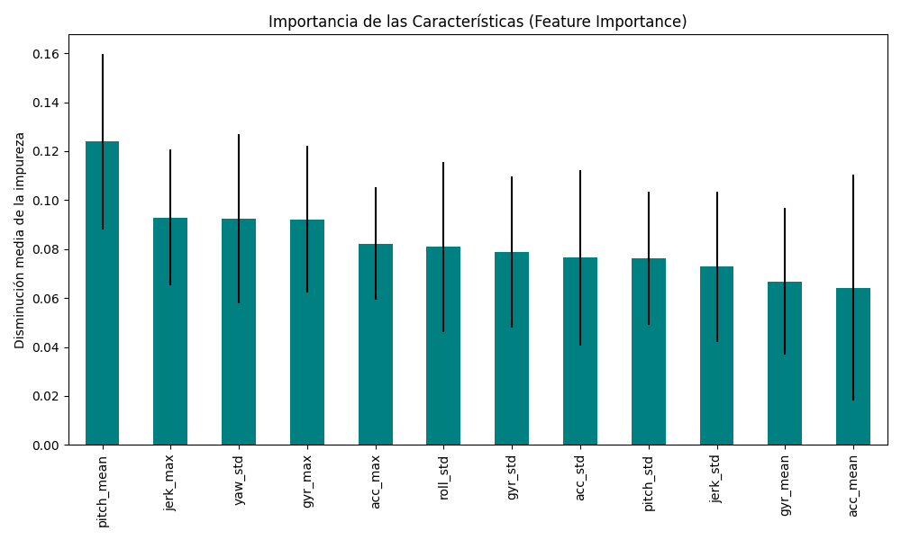

# Modelo de Inteligencia Artificial (Actividad)

Este documento detalla la evolución y el rendimiento del clasificador de actividad basado en Machine Learning.

## Resumen de Evolución
Inicialmente, el modelo presentaba una precisión muy baja (52%) debido a la simplicidad de las características extraídas. Tras una fase de **Ingeniería de Características**, logramos elevar el rendimiento significativamente.

| Versión | Características | Accuracy | F1-Score (Promedio) |
| :--- | :--- | :---: | :---: |
| v1.0 | Estadísticas básicas (Acel/Giro) | 0.52 | 0.50 |
| **v2.0** | **+ Jerk, + Euler Variability** | **0.80** | **0.86** |

## Análisis de Importancia de Características
Para entender qué está mirando la IA para tomar decisiones, analizamos la importancia de cada variable:



### Observaciones:
- **Jerk (Tirón):** Se ha convertido en uno de los predictores más fuertes, validando nuestra hipótesis de que las aceleraciones rápidas son clave para distinguir "Carga".
- **Variabilidad de Pitch/Roll:** La estabilidad de la orientación es fundamental para detectar el estado de "Reposo".

## Reporte de Clasificación Final (v2.0)
```text
              precision    recall  f1-score   support
       Carga       0.78      0.85      0.81        79
  Movimiento       0.81      0.75      0.78        69
        Otro       1.00      0.71      0.83         7
      Reposo       1.00      1.00      1.00         2
```

## Conclusión
El modelo es ahora capaz de distinguir con un **80% de acierto** entre las actividades críticas del operador. El siguiente paso lógico sería integrar un suavizado temporal (Votación) para eliminar ruidos en las transiciones de estados.
